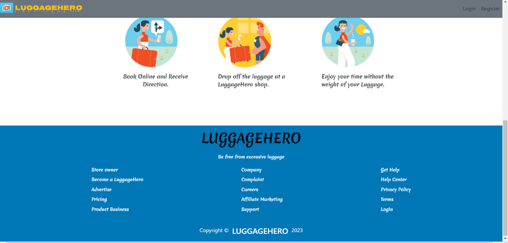
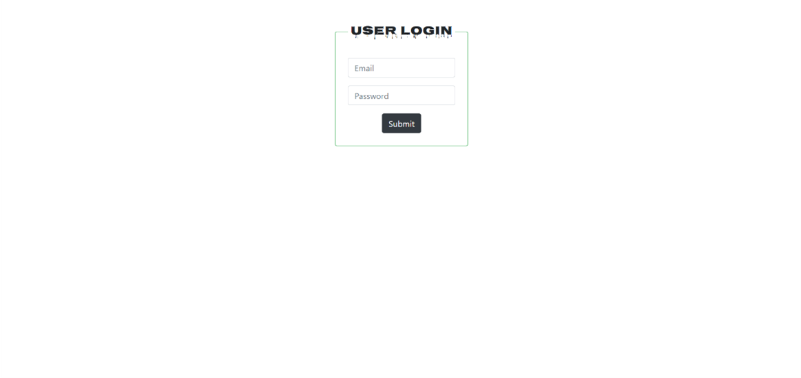
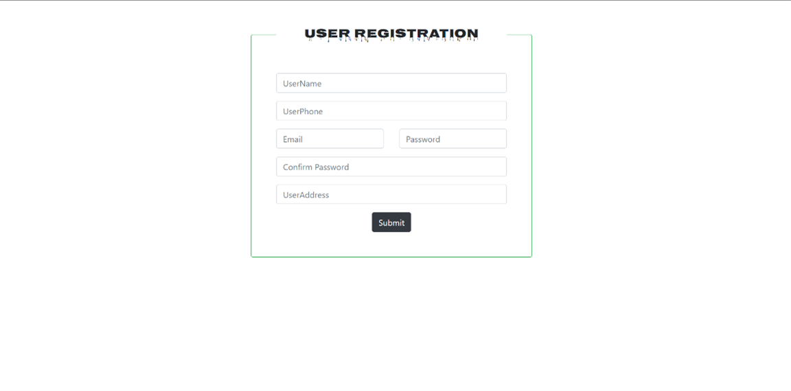
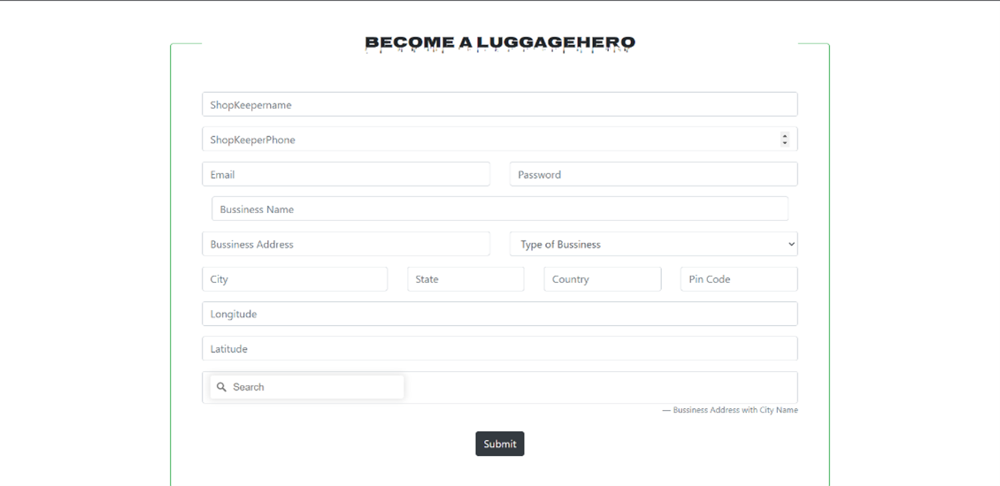
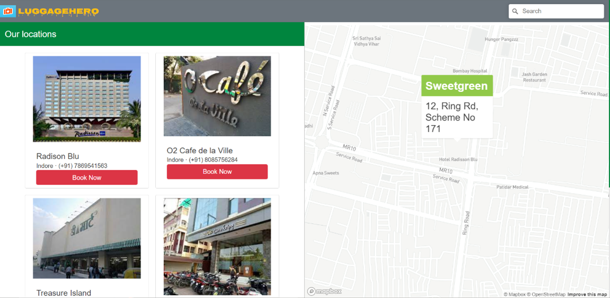
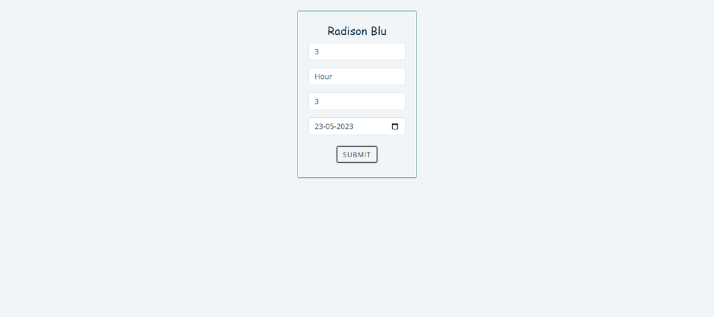
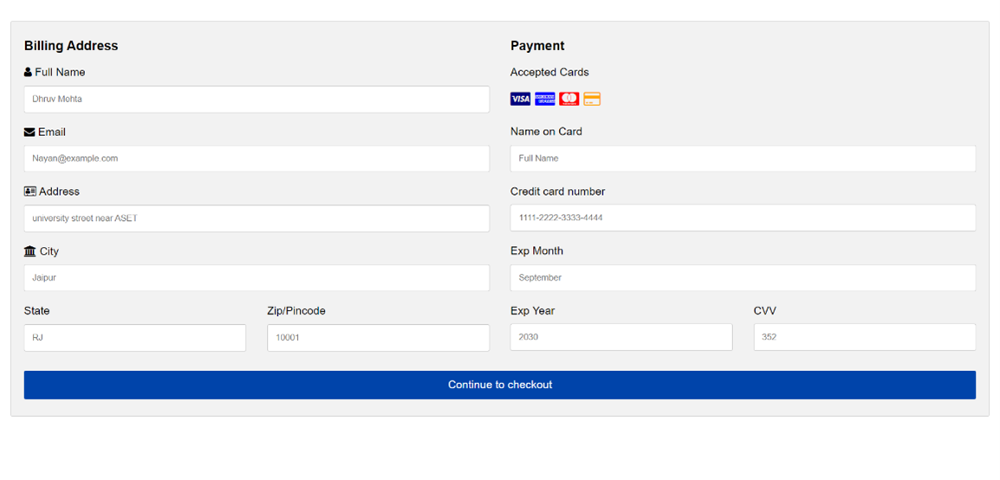
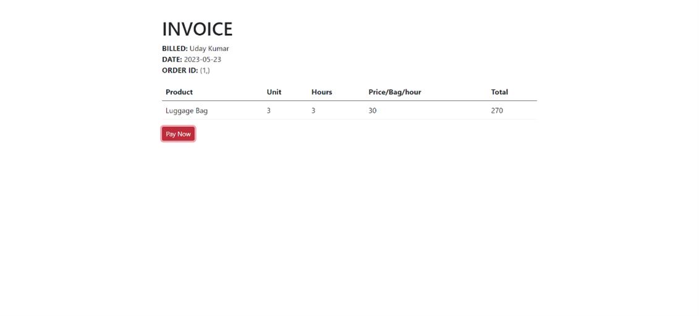

# LuggageHero

LuggageHero is a web application that was built mainly with HTML, CSS, Javascript, python, SQL as a final year project. Built this web application to help tourists and students like me who travel with excess luggage and usually have no place to temporarily keep them.
Tourists or students, such as myself, sometimes have connecting flights or trains, with a lot of time frame in between the stops and have no place to keep the luggage, to roam freely. This webiste acts as a cloak room locator around your location so that you can roam, luggage free!

## Table of Contents
- [Overview](#Overview)
  - [Screenshot](#screenshot)
  - [Links](#links)
- [Author](#author)

## Overview

### Screenshot

### Links
- Solution URL: [Github](https://github.com/Dante-afk/Luggagehero/)

## Author

- Website - [Dhruv Mehta](https://dhruvmehta02.netlify.app/)
